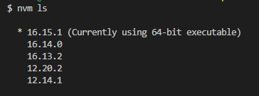

# Easily manage several versions of Node.js on Windows

[Node Version Manager for Windows](https://github.com/coreybutler/nvm-windows), as its name suggests, will simplify your life to manage several versions of Node.js on your computer.

**Installation process:**
- Download the ***nvm-setup.zip*** file of the latest stable release [here](https://github.com/coreybutler/nvm-windows/releases)
- Unzip the archive and run the installer to install NVM on your computer
- Once NVM is installed, open a Windows command prompt and run the following commands:
```
$ nvm install 16.15.1
$ nvm use 16.15.1
```

Now you have version `16.15.1` of Node.js installed and used on your computer.

If you need another one in the future, you can run the same commands:
- `nvm install` (to install a new version)
- `nvm use` (to use a particular one).

To list the different versions available on your computer, you can run the `nvm ls` command. An asterisk will be present next to the version in use:


