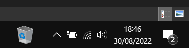

# How to add the recycle bin to the Windows 10 taskbar

1. Right-click the taskbar and check the `Lock the taskbar` option
2. Create a new `Recycle Bin` folder on the desktop
3. Drag the real Recycle Bin into your new folder
4. Right-click the taskbar again and select `Toolbars` > `New toolbar...`
5. Navigate to your new `Recycle Bin` folder and then press `Select Folder`
6. Now, you should find a Recycle Bin shortcut menu on the right of the taskbar. Right-click this new menu and uncheck the `Show Text` and `Show title` options
7. Right-click the Recycle Bin menu again and select `View` > `Large icons`
8. Reposition the menu as you wish by dragging the double arrow beside it left and right
9. Right-click the taskbar and and check the `Lock the taskbar` option to cement the Recycle Bin shortcut's position

Now you can open/empty the Recycle Bin from the taskbar without returning to the desktop:

